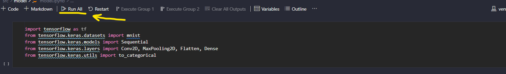

# Ponderada MNIST

## Estrutura de Patas
```bash
|-- main.py
|-- README.md
|-- .gitignore
|-- requirements.txt
|-- src/
|-- |-- backend/
|-- |-- app.py
|-- |-- templates/
|-- |-- |-- index.html
|-- |-- model/
|-- |-- |-- model.ipynb
|-- |-- |-- pesos.h5
|-- |-- public/
|-- |-- |-- video_demo.mp4
|-- |-- scripts/
|-- |-- |-- executor.bat
|-- |-- |-- executor.sh
```

## Como executar

### Executando modelo

Para executar o modelo de rede neural, basta acessar o arquivo `model.ipynb`, na pasta `src/model` e clicar no botão de execução total do caderno.



### Executando aplicação

#### Basta executar o programa main.py

- Para Windows
```bat
python main.py
```

- Para Linux
```bat
python3 main.py
```

#### Caso não dê certo, siga os seguintes passos:

1. Crie o ambiente virtual

    - Windows
    ```bat
    python -m venv venv
    ```

    - Linux
    ```bat
    python3 -m venv venv
    ```

2. Ative o ambiente virtual

    - Windows
    ```bat
    source venv/Scripts/activate
    ```

    - Linux
    ```bat
    source venv/bin/activate
    ```

3. Instale as dependências

    ```bat
    pip install -r requirements.txt
    ```

    - Linux
    ```bat
    python3 -m pip install -r requirements.txt
    ```

4. rode a aplicação

    - Windows
    ```bat
    python src/backend/app.py
    ```

    - Linux
    ```bat
    python3 src/backend/app.py
    ```

## Vídeo demonstrativo
![[Video Demo]](./src/public/video_demo.mp4)